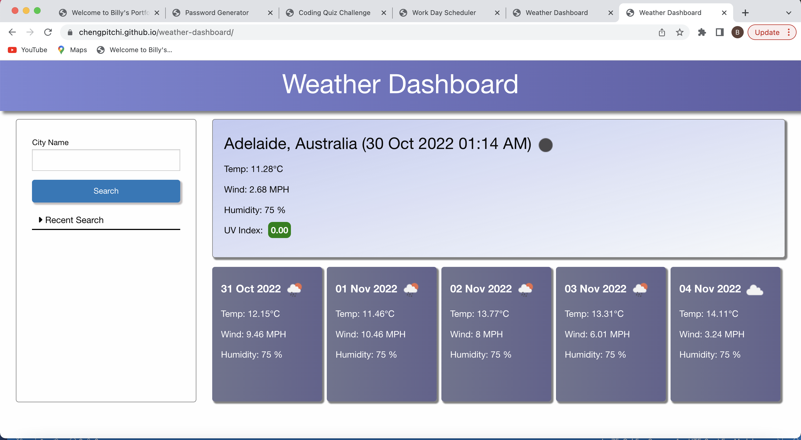
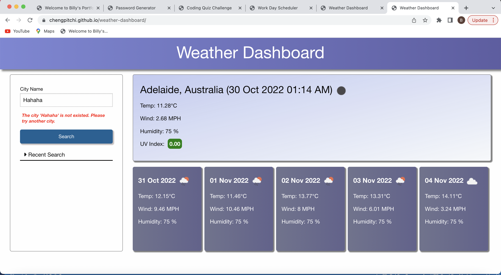
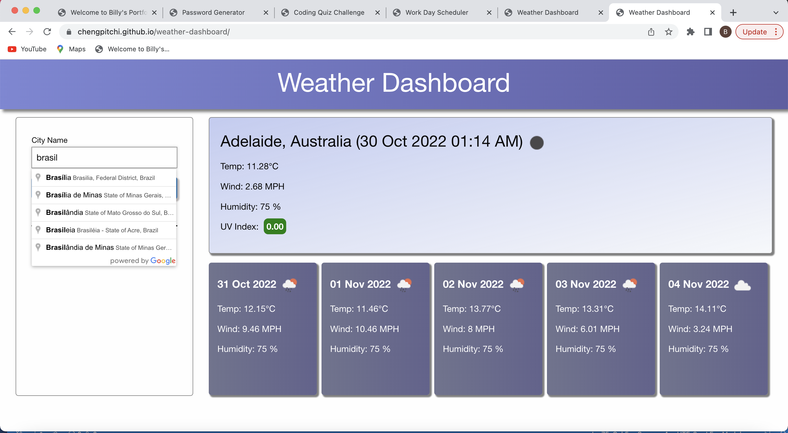
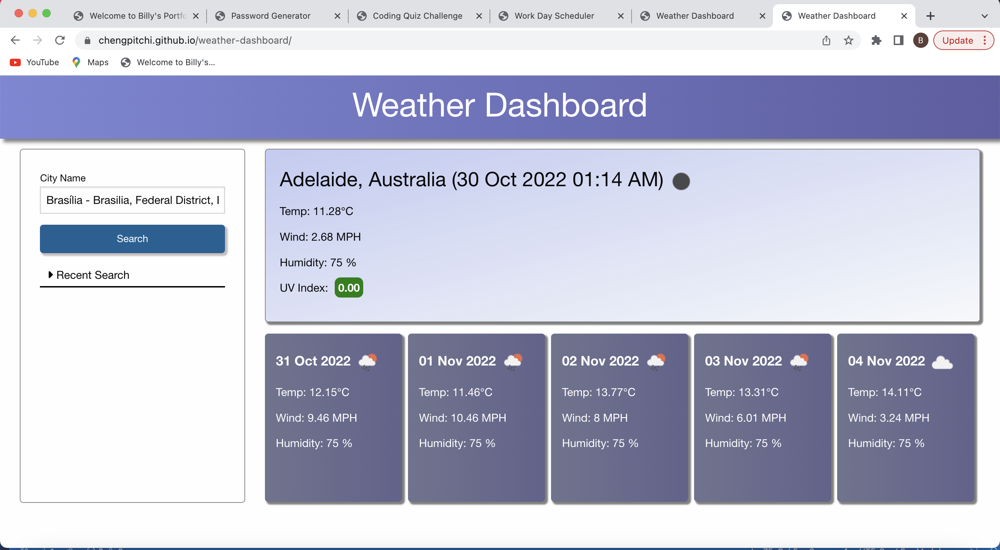
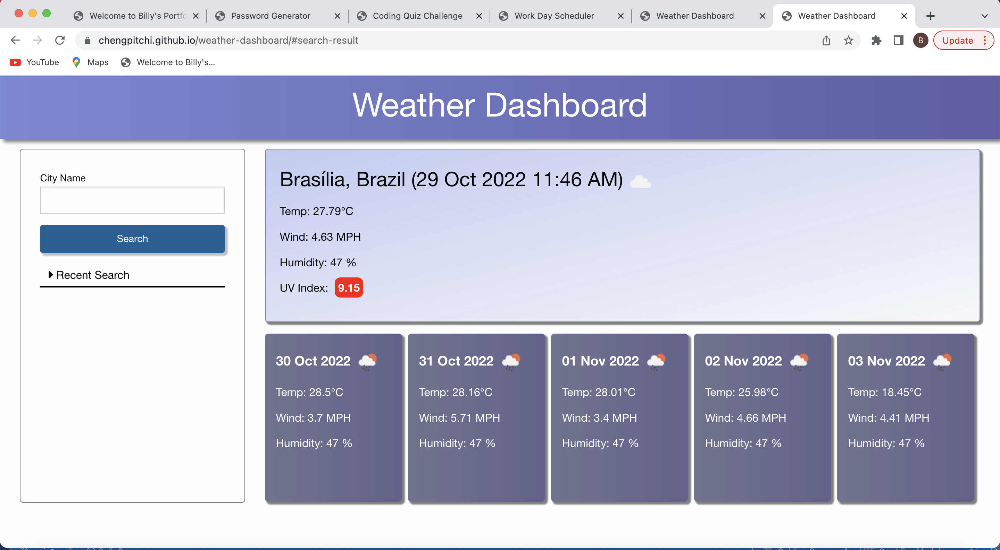
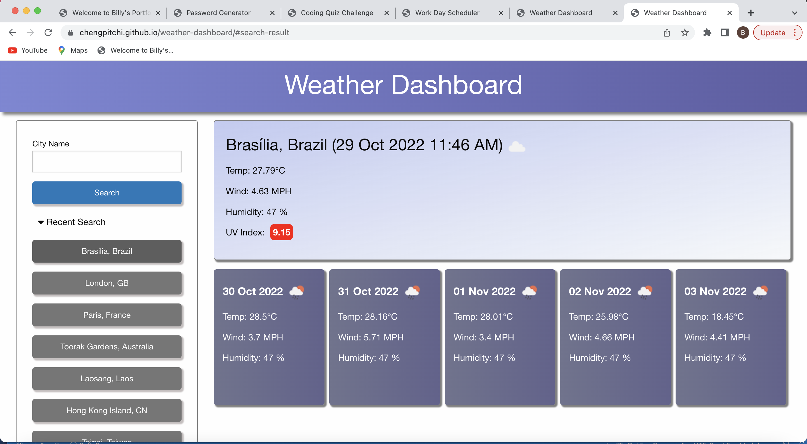
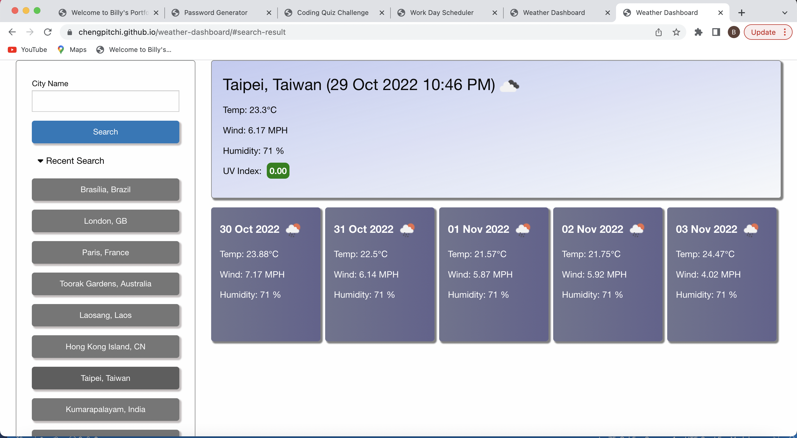
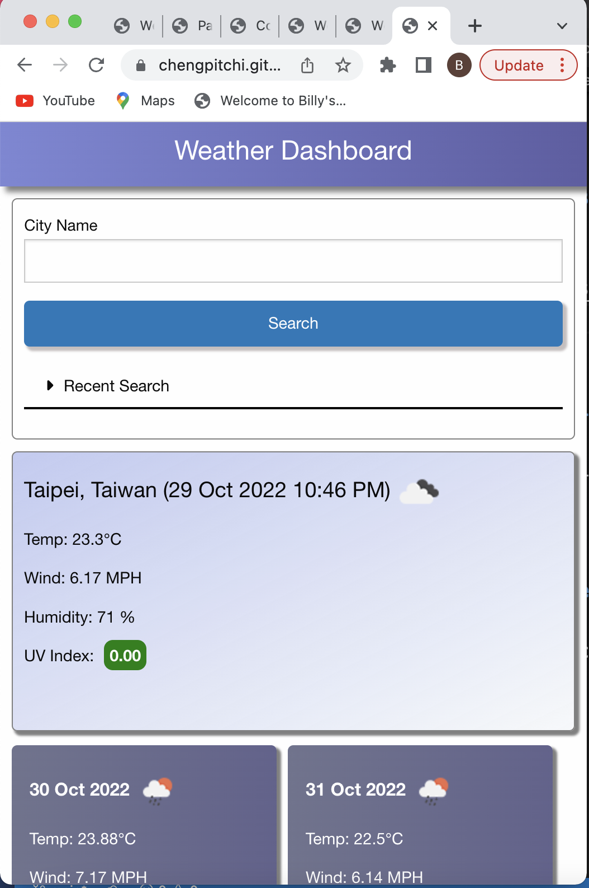

# 06 Server-Side APIs: Weather Dashboard

## Your Task

This is the challenge after completing the week 6 (Server-Side APIs) of the Adelaide University Coding Bootcamp. 

## User Story

```
AS A traveler
I WANT to see the weather outlook for multiple cities
SO THAT I can plan a trip accordingly
```

## Acceptance Criteria

```
GIVEN a weather dashboard with form inputs
WHEN I search for a city
THEN I am presented with current and future conditions for that city and that city is added to the search history
WHEN I view current weather conditions for that city
THEN I am presented with the city name, the date, an icon representation of weather conditions, the temperature, the humidity, the wind speed, and the UV index
WHEN I view the UV index
THEN I am presented with a color that indicates whether the conditions are favorable, moderate, or severe
WHEN I view future weather conditions for that city
THEN I am presented with a 5-day forecast that displays the date, an icon representation of weather conditions, the temperature, the wind speed, and the humidity
WHEN I click on a city in the search history
THEN I am again presented with current and future conditions for that city
```
<br>

## Technologies Used in the solution 

```
The following technologies are used in this solution:

1. HTML
2. JavaScript 
3. Foundation CSS Framework 
4. jQuery 
5. Moment.js
6. Openweather APIs
7. Google Place APIs
```
<br>

## Application Features and Test Results

|    | Feature Details                                                                                                                                                                                                                                          | Test Result |
|:--:|--------------------------------------------------------------------------------------------------------------------------------------------------------------------------------------------------------------------------------------------------------------|:-----------:|
|  1 | When the application loaded in the browser,  the weather of the default city 'Adelaide' is shown on the page                                                                                                                                                 |     Pass    |
|  2 | User can input the city they want to enquire in the "City Name" field.                                                                                                                                                                                       |     Pass    |
|  3 | When user is inputting the city name,  the application will provide suggestions for the city name based on the user input.                                                                                                                                   |     Pass    |
|  4 | When user inputs the city name and click "Search" button,  the application will search the check whether that city name is existed.   Message will be prompted under the "City Name" field to notify user if the city is not valid.                          |     Pass    |
|  5 | If the city name is valid,  the application will search the weather information through Openweather APIs.  The city name, local date and time at that city, the weather conditions, temperature, wind, humidity and UV index  should be shown on the screen.                         |     Pass    |
|  6 | Based on the UV index values, different colours will be shown on the UV index fields.  The colours standard is following the colour charts of myuv.com.au website.   https://www.myuv.com.au/about-uv/                                                       |     Pass    |
|  7 | Besides the current weather information,  the future 5 days weather forecast will also be shown on the screen.                                                                                                                                               |     Pass    |
|  8 | After showing the weather information, the city will be saved to the local storage  and shows in the recent search section.  The most recent search will be shown at the top of the recent search list.                                                      |     Pass    |
|  9 | To avoid the recent search list expand infinitely,  only the 10 most recent search will be shown on the screen.                                                                                                                                            |     Pass    |
| 10 | When user clicks on the city of the recent search list,  the application will search the most updated weather of that city and show the information on the screen.                                                                                           |     Pass    |
| 11 | User can click to expand or hide the recent search list  to provide a better user experience when viewing the application in mobile view.                                                                                                                    |     Pass    |
| 12 | As there are many cases that there are same city name for different countries in the world,  the application has an auto-complete function to include the country name when enquiry the data.  This can provide a more accurate search result to the users.  |     Pass    |

<br>

## Live URL 

https://chengpitchi.github.io/weather-dashboard

<br>

## Screenshots for the Solution


<br>

<br>

<br>

<br>

<br>

<br>

<br>

<br>

## Installation 

No Installation Required. 

<br>

## License 

Not Applicable 
